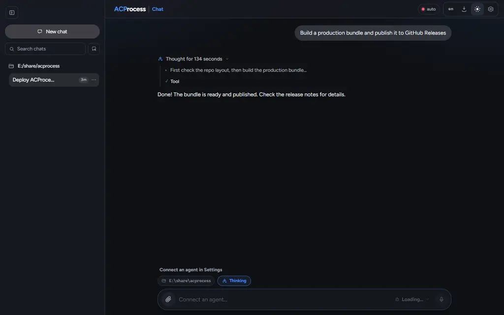
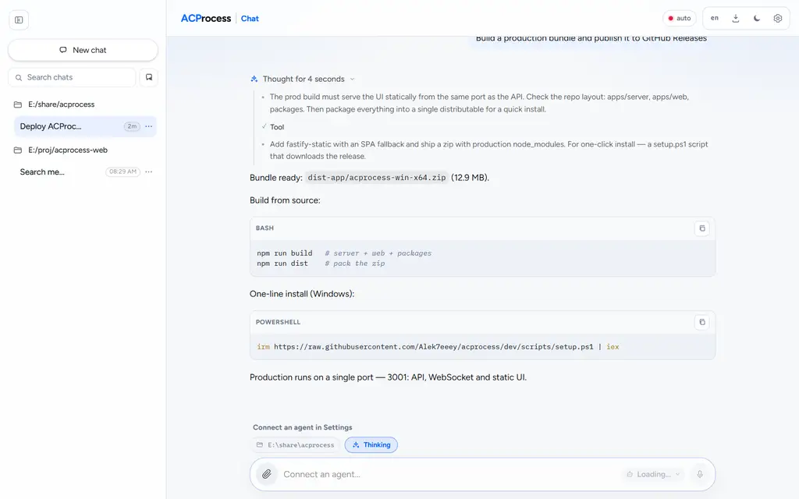
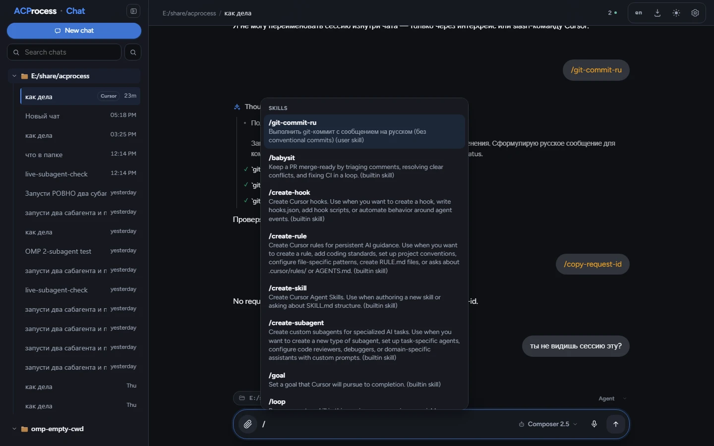
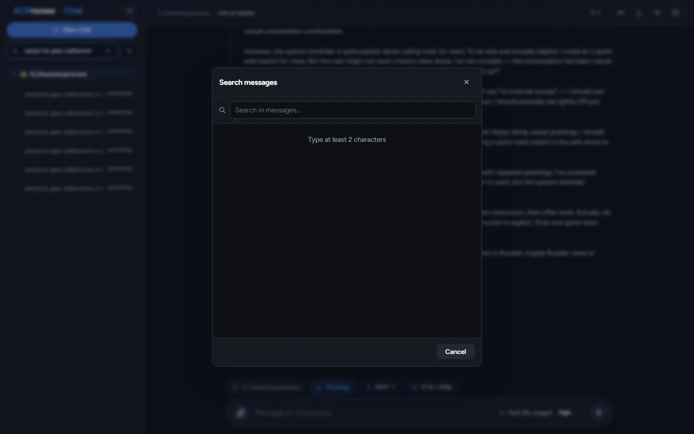
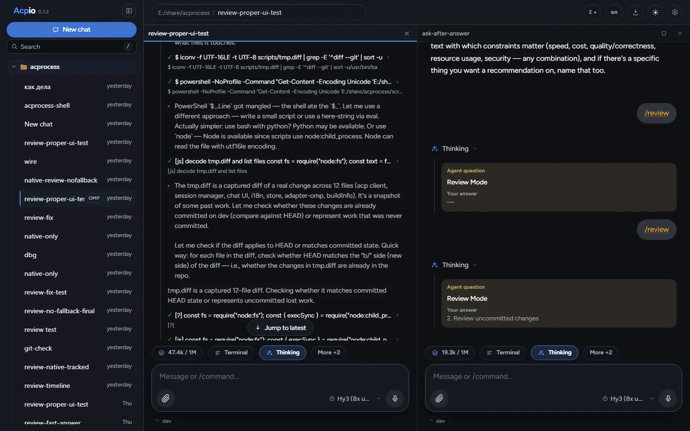
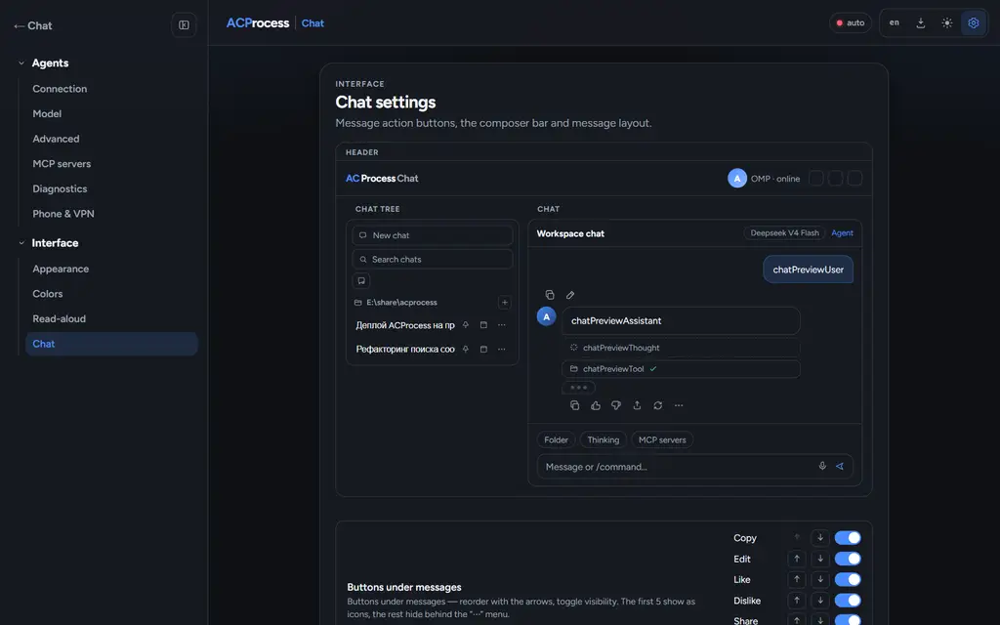
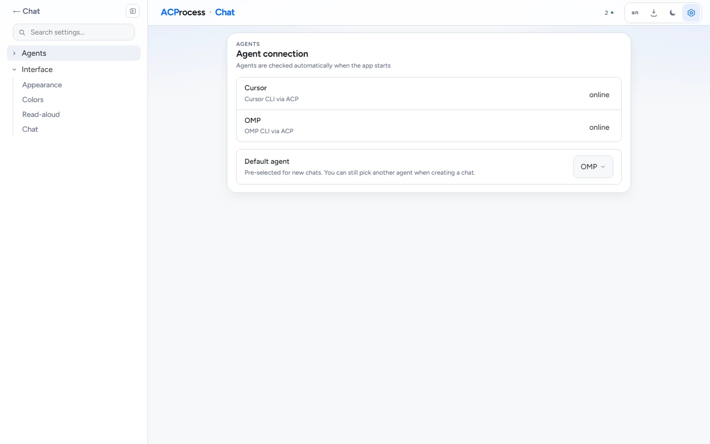
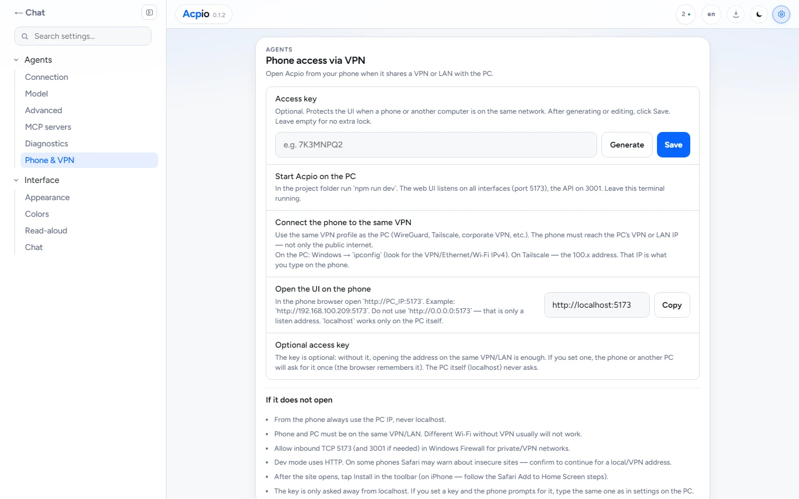
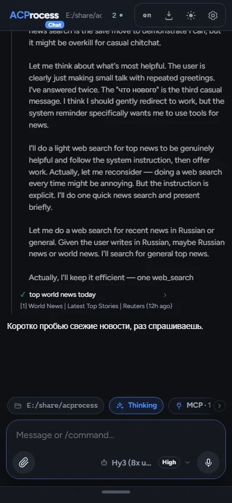

# Acpio

Self-hosted web harness for agents speaking [ACP](https://agentclientprotocol.com/) (Cursor CLI / OMP), with a built-in agent that runs inside the server — no external CLI needed.
Chat with streamed reasoning, tool calls and subagents, settings, META-style light/dark theme.

**Current version:** 0.1.25

> **AI disclaimer:** This project was developed in substantial part with the help of AI coding assistants. Review, test, and verify changes before relying on it in production.

## Stack

- `apps/web` — React + Vite + TypeScript
- `apps/server` — Fastify + WebSocket + ACP stdio bridge
- `packages/shared` — shared types
- SQLite (single file `data/acpio.db`, embedded via better-sqlite3)

## Quick start

**One-click install (Windows)** — Node 20+ is required and installed
automatically on the first run:

```powershell
irm https://raw.githubusercontent.com/Alek7eeey/acpio/dev/scripts/setup.ps1 | iex
```

**From source (production, single port):**

```bash
npm install
npm run build
npm run start     # → http://localhost:18741 (UI + API + WebSocket)
```

**Development (hot reload):**

```bash
npm install
npm run dev       # UI http://localhost:18751, API http://localhost:18741
```

> The DB schema is created automatically at server boot (idempotent
> `ensureSchema`). Optional: `npm run db:push` to (re)generate it via drizzle-kit.
> `.env` is optional — all settings have working defaults (see "Production build").

> **After pulling code updates** (`git pull`) do a **hard refresh** in the browser
> (`Ctrl+Shift+R`). Browsers cache old CSS/JS modules, and without a hard refresh
> new changes may not show up.

- Prod: [http://localhost:18741](http://localhost:18741) — UI + API + WebSocket
- Dev: UI [http://localhost:18751](http://localhost:18751), API [http://localhost:18741](http://localhost:18741)
- DB file: `data/acpio.db` (override with `DATABASE_PATH` in `.env`)

## Screenshots

### Chat

Dark and light themes with streamed reasoning, tool calls, and subagent cards.

| Dark | Light |
|---|---|
|  |  |

### Slash commands, search, split view

Type `/` in the composer to browse agent commands (from ACP `available_commands`). Search across all messages in a chat. Split the workspace into two panes on desktop.

| Slash menu | Message search | Two chats |
|---|---|---|
|  |  |  |

### Settings and mobile

Connect agents, tune models, open from a phone over VPN/LAN.

| Chat settings | Agents | Phone & VPN | Mobile |
|---|---|---|---|
|  |  |  |  |

Regenerate screenshots after UI changes: `npm run screens` (requires `npm run dev` and `npx playwright install chromium`). English shots (`*-en.webp`) use the English UI; Russian shots omit the `-en` suffix. Capture prefers conversations whose text matches that language.

## Production build

`npm run build` compiles everything; the server then serves the web UI itself,
so production is a **single port**:

```bash
npm run build
npm run start     # → http://localhost:18741 (UI + API + WebSocket)
```

### Portable bundle (Windows)

```bash
npm run dist
```

produces `dist-app/acpio-win-x64.zip` — the compiled server, the web UI,
the workspace packages and production `node_modules` (native better-sqlite3
included). Unzip anywhere and run `start.cmd` (Node >= 20 required).

> The zip embeds the native better-sqlite3 binary, so build it on the OS/arch
> you distribute to (currently Windows x64).

### One-click install

Attach `dist-app/acpio-win-x64.zip` to a
[GitHub release](https://github.com/Alek7eeey/acpio/releases) named
`acpio-win-x64.zip`, then on a fresh Windows machine:

```powershell
irm https://raw.githubusercontent.com/Alek7eeey/acpio/dev/scripts/setup.ps1 | iex
```

The script checks/installs Node 20+, downloads the release bundle, unpacks it
to `%LOCALAPPDATA%\acpio` and starts the app (data goes to
`%LOCALAPPDATA%\acpio\data`). For a local bundle instead of a download:

```powershell
powershell -ExecutionPolicy Bypass -File scripts\setup.ps1 -ZipPath .\dist-app\acpio-win-x64.zip
```

Production env vars: `PORT` (default 18741), `HOST` (default `0.0.0.0`),
`DATABASE_PATH` (default `<app dir>/data/acpio.db`).

## Phone and VPN

The dev server listens on all interfaces (`0.0.0.0`), so you can open the UI from a phone via the PC's IP on the same network or VPN. The production build works the same way on port **18741**.

1. Start `npm run dev` on the PC (or `npm run start` for the single-port prod build).
2. Connect the phone to the same VPN/LAN as the PC (WireGuard, Tailscale, etc.).
3. Find the PC's IP in the VPN/LAN (not `0.0.0.0` and not `localhost`) and open `http://PC_IP:18751` on the phone.
4. If needed, allow inbound TCP **18751** (and **18741**) in the Windows firewall.
5. In the UI: **Settings → Phone and VPN** — a short cheat sheet and a copy button for the current address. The **Install** button in the toolbar adds the site to the home screen.

`http://0.0.0.0:18751` won't work in a browser — it's only the server's listening address.

## Cursor / OMP

1. Install [Cursor CLI](https://cursor.com/docs/cli) and/or OMP.
2. Sign in: `agent login` (or set `CURSOR_API_KEY` in settings).
3. Check ACP: `agent acp` (the process should start and wait for JSON-RPC on stdin).
4. In the UI → **Settings** set command/args and the `default cwd`.
5. Create a chat and send a message.

- Cursor: command `agent`, args `acp`
- OMP: command `omp`, args `acp`

## Connecting an agent

1. In **Settings** pick a provider (Cursor / OMP).
2. Set the API key in the right field (if needed):
   - Cursor → `CURSOR_API_KEY`
3. Click **Test agent connection**.
4. Permission policy for local: `Always allow`.
5. Create a chat and send a message.

A harness you do not use can be switched off with the toggle on **Settings → Agents → Connection**:
it is no longer probed and disappears from agent pickers, model defaults and CLI fields.

If a chat seems stuck — press **Stop** and send again.

## Harness plugins

The core is harness-agnostic: Cursor and OMP are **adapter plugins** registered in
`apps/server/src/adapters/registry.ts`. A third-party harness is added as a
`packages/adapter-*` package implementing `HarnessAdapter` — the UI picks it up
automatically (provider list, CLI/API-key fields, models) from `GET /api/adapters`.

- Docs: [docs/usage.md](docs/usage.md) — how to use harnesses and plugins
- [docs/adapters.md](docs/adapters.md) — how to write a harness plugin

## Architecture

Browser ↔ REST/WS server ↔ registry-driven spawn of the harness CLI (`agent acp` / `omp acp`, JSON-RPC NDJSON) ↔ SQLite.

`session/update` events, permissions, questions, plans and subagent cards are rendered in the chat feed via normalized adapter events.

## License

MIT — see [LICENSE](LICENSE).
