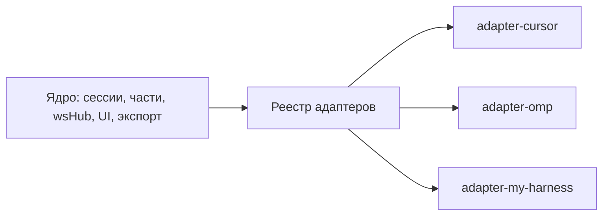

# Плагины харнессов: руководство разработчика

Acpio умеет работать с любым агентом, говорящим на [ACP](https://agentclientprotocol.com/)
(JSON-RPC over stdio). Ядро (сервер + веб) не знает имена харнессов — оно знает только
**реестр адаптеров**. Каждый харнесс (Cursor, OMP или ваш собственный) — это пакет,
реализующий интерфейс `HarnessAdapter` из `@acpio/shared`.



## Где что лежит

| Что | Путь |
|---|---|
| Контракт адаптера | `packages/shared/src/adapters.ts` |
| Адаптер Cursor | `packages/adapter-cursor/src/index.ts` |
| Адаптер OMP | `packages/adapter-omp/src/index.ts` |
| Реестр (единственное место, знающее конкретные харнессы) | `apps/server/src/adapters/registry.ts` |
| Мета для веба (`GET /api/adapters`) | `apps/server/src/routes.ts` |

## Модель

Адаптер — это **декларативные данные + несколько поведенческих хуков**. Он описывает:

1. **CLI и конфиг** — какую команду запускать, какие аргументы, какой ключ API, где искать бинарник, что показать, если команды нет.
2. **Жизненный цикл сессии** — как восстанавливать сохранённую сессию агента (`resume` / `load` / `new`), нужно ли гасить реплей истории, есть ли аутентификация при старте.
3. **Возможности** — параметрический пикер модели, стриминг размышлений субагентов, облачный каталог моделей, режимы по умолчанию, kinds-субагентов.
4. **Расширения** — как методы вашего харнесса (`cursor/task`, `_omp/agents/update`, …) отображаются на **нормализованные события ядра** и как строить карточки субагентов.
5. **Каталог моделей** — как получить расширенный список моделей, если ACP-опции недостаточно.

Ядро переключается по **нормализованным kind'ам**, а не по именам методов. Ваш харнесс
может называть вещи как угодно — ядро увидит `todos`, `subagent_task`, `subagent_roster`,
`subagent_progress`, `image`.

## Интерфейс `HarnessAdapter`

Все поля обязательны, кроме помеченных `?`. Типы — в `packages/shared/src/adapters.ts`.

```ts
interface HarnessAdapter {
  id: string;                    // id провайдера, хранится в сессиях/настройках
  label: string;                 // «Cursor», «OMP», …
  descriptionKey: string;        // i18n-ключ описания в настройках

  // CLI и конфиг
  commandField: string;          // поле настроек с командой (например "myHarnessCommand")
  argsField: string;             // поле настроек с массивом аргументов
  apiKeyField?: string;          // поле настроек с API-ключом
  envApiKeyName?: string;        // env-переменная, в которую экспортируется ключ
  defaultCommand: string;        // команда по умолчанию (когда поле пустое)
  defaultArgs: string[];         // аргументы по умолчанию
  binaryNames: string[];         // имена бинарников для поиска на Windows
  binaryDirs: string[];          // каталоги %LOCALAPPDATA%/<dir>, добавляемые в PATH
  installHint: string;           // текст «как установить», {command} подставляется

  // Жизненный цикл сессии
  restoreMode: "resume" | "load" | "new";
  suppressReplayOnLoad: boolean; // гасить реплей истории при session/load
  authenticateMethodId?: string; // метод authenticate при старте ("cursor_login")

  // Возможности
  parameterizedModelPicker: boolean; // отдельные опции fast/effort/… в ACP
  subagentStreaming: boolean;        // стриминг транскриптов субагентов
  cloudCatalog: boolean;             // облачный список моделей, короткий TTL кэша
  defaultModes: AgentModeOption[];   // режимы, если агент не отдаёт свои
  subagentToolKinds: readonly string[]; // ACP tool kinds, означающие субагента

  // Расширения
  requestKinds: Record<string, "permission" | "ask_question" | "create_plan">;
  extensionKinds: Record<string, AdapterExtensionKind>;
  extensionReply?: (method, params) => unknown;       // ответный конверт
  subagentTaskCard?: (params) => { toolCallId?; card } | null;
  subagentCardFromRoster?: (entry) => SubagentCardUpdate | null;
  subagentCardFromProgress?: (entry) => SubagentProgressUpdate | null;
  readSubagentTranscript?: (client, agentId, fromByte) => Promise<SubagentTranscriptPage | undefined>;
}
```

### Жизненный цикл сессии

- **`resume`** — при старте вызывается `session/resume`: тихое восстановление контекста, история не реплеится (так делает OMP).
- **`load`** — при старте вызывается `session/load`: харнесс реплеит всю историю. Если она уже в БД ядра — поставьте `suppressReplayOnLoad: true`, чтобы ядро гасило апдейты реплея (так делает Cursor).
- **`new`** — всегда `session/new`, восстановление не используется.

### Нормализованные события

| kind | Откуда | Что делает ядро |
|---|---|---|
| `todos` | метод обновления todo-списка | парт `todo` в сообщении |
| `subagent_task` | запрос «запущен субагент» (один вызов) | карточка субагента, дедуп по `toolCallId` |
| `subagent_roster` | полный снапшот субагентов | апсёрт карточек по `agentId`, спавн только для `running` |
| `subagent_progress` | живой апдейт работы субагента | апсёрт карточки, тело = интент/инструмент/вывод |
| `image` | результат генерации изображения | парт `status` с типом image |

**Карточки субагентов.** Хук получает «сырую» запись вашего харнесса и возвращает
нормализованную `SubagentCardUpdate` (`agentId`, `status: "running"|"completed"|"failed"`,
`title`, `description?`, `body?`, `metrics?`, `resolvedModel?`, `raw`). Верните `null`, чтобы
пропустить запись (например, не-sub записи ростера). Ядро само решает, когда спавнить
карточку: для ростеров — только для `running` (снапшоты включают и idle-агентов), для
`subagent_task` — всегда.

**Стриминг размышлений субагентов.** Если `subagentStreaming: true`, ядро опрашивает
транскрипт по байтовому смещению. Хук `readSubagentTranscript(client, agentId, fromByte)`
возвращает одну страницу (`messages`, `fromByte`, `nextByte`, `reset`). Сам поллинг,
дедупликация и лимиты — в ядре.

**Каталог моделей.** Список моделей и их параметры берутся из ACP-опций самого агента.
`cloudCatalog: true` помечает список, который часто меняется (облачный): ядро перечитывает
его раз в пару минут вместо того, чтобы доверять кэшу сутки.

## Как написать свой адаптер

### 1. Пакет

В монорепо воркспейсы — `packages/*`. Создайте пакет:

```bash
mkdir packages/adapter-my-harness
```

`packages/adapter-my-harness/package.json`:

```json
{
  "name": "@acpio/adapter-my-harness",
  "version": "0.1.0",
  "private": true,
  "type": "module",
  "main": "./src/index.ts",
  "types": "./src/index.ts",
  "exports": { ".": "./src/index.ts" },
  "scripts": {
    "build": "tsc -p tsconfig.json",
    "dev": "tsc -p tsconfig.json --watch"
  },
  "dependencies": { "@acpio/shared": "*" },
  "devDependencies": { "typescript": "^5.8.2" }
}
```

`packages/adapter-my-harness/tsconfig.json` — скопируйте из `packages/adapter-cursor/tsconfig.json`.

### 2. Реализация

`packages/adapter-my-harness/src/index.ts`:

```ts
import { type HarnessAdapter } from "@acpio/shared";

export const myHarnessAdapter: HarnessAdapter = {
  id: "my-harness",
  label: "My Harness",
  descriptionKey: "settings.myHarnessDesc",

  commandField: "myHarnessCommand",
  argsField: "myHarnessArgs",
  apiKeyField: "myHarnessApiKey",
  envApiKeyName: "MY_HARNESS_API_KEY",
  defaultCommand: "myharness",
  defaultArgs: ["acp"],
  binaryNames: ["myharness"],
  binaryDirs: ["myharness"],
  installHint:
    'Команда "{command}" не найдена. Установите my-harness и укажите его в «CLI и права».',

  restoreMode: "resume",
  suppressReplayOnLoad: false,

  parameterizedModelPicker: false,
  subagentStreaming: false,
  cloudCatalog: false,
  defaultModes: [],
  subagentToolKinds: ["task"],

  requestKinds: { "session/request_permission": "permission" },
  extensionKinds: {
    "myharness/task": "subagent_task",
    "myharness/todos": "todos",
  },

  subagentTaskCard(params) {
    const title = String(params.title ?? "Субагент").trim();
    return {
      toolCallId: String(params.toolCallId ?? ""),
      card: {
        agentId: String(params.agentId ?? ""),
        status: params.status === "running" ? "running" : "completed",
        title,
        description: title,
        ...(typeof params.prompt === "string" ? { body: params.prompt } : {}),
        raw: params,
      },
    };
  },
};
```

### 3. Регистрация

Единственное изменение ядра — `apps/server/src/adapters/registry.ts`:

```ts
import { myHarnessAdapter } from "@acpio/adapter-my-harness";

const ALL: HarnessAdapter[] = [cursorAdapter, ompAdapter, myHarnessAdapter];
```

### 4. npm install

```bash
npm install
```

Это создаст симлинк воркспейса. Корневая сборка уже включает адаптеры:
`npm run build` собирает `adapter-cursor` и `adapter-omp` — добавьте свой в корневой
`package.json`, скрипт `build`.

### 5. i18n

Описание в настройках берётся по `descriptionKey` из `apps/web/src/lib/i18n-messages/ru.json`
и `en.json` (секция `settings`):

```json
"myHarnessDesc": "Мой харнесс через ACP"
```

### 6. Проверка

- Веб сам подхватит адаптер: список провайдеров в **Настройки → Агенты → Подключение**
  и поля «CLI и права» (команда/аргументы/API-ключ) строятся из меты `GET /api/adapters`.
- Ядро само валидирует провайдера по реестру — отдельно ничего включать не нужно.
- Напишите тесты по образцу `apps/server/src/adapters/registry.test.ts` (там же проверки
  `cursorAdapter`/`ompAdapter`).

## Чего НЕ нужно делать

- Не добавляйте ветвления `provider === "…"` в ядро — всё харнесс-специфичное живёт в адаптере.
- Не трогайте `settings.ts` валидацию — она уже читает `adapters.ids()`.
- Не расширяйте `AgentProvider` union — он открыт (`"cursor" | "omp" | (string & {})`).

## Ссылки

- Контракт: `packages/shared/src/adapters.ts`
- Референс-адаптеры: `packages/adapter-cursor/src/index.ts`, `packages/adapter-omp/src/index.ts`
- Реестр: `apps/server/src/adapters/registry.ts`
- Тесты реестра: `apps/server/src/adapters/registry.test.ts`
- Инструкция по использованию: [docs/usage-ru.md](usage-ru.md)
