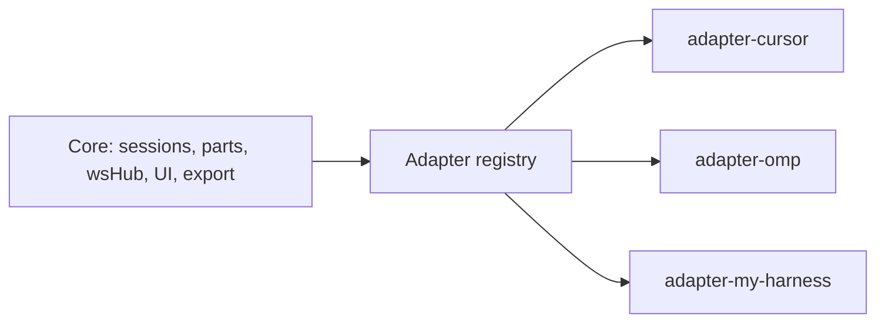

# Harness Plugins: Developer Guide

ACProcess works with any agent speaking [ACP](https://agentclientprotocol.com/)
(JSON-RPC over stdio). The core (server + web) does not know harness names — it only knows
the **adapter registry**. Each harness (Cursor, OMP, or your own) is a package implementing
the `HarnessAdapter` interface from `@acprocess/shared`.



## Where things live

| What | Path |
|---|---|
| Adapter contract | `packages/shared/src/adapters.ts` |
| Cursor adapter | `packages/adapter-cursor/src/index.ts` |
| OMP adapter | `packages/adapter-omp/src/index.ts` |
| Registry (the only place that knows concrete harnesses) | `apps/server/src/adapters/registry.ts` |
| Web metadata (`GET /api/adapters`) | `apps/server/src/routes.ts` |

## The model

An adapter is **declarative data plus a few behavior hooks**. It describes:

1. **CLI & config** — which command to spawn, its args, the API key, where to find the binary, what to show when the command is missing.
2. **Session lifecycle** — how to restore a stored agent session (`resume` / `load` / `new`), whether the history replay must be muted, whether boot-time auth is needed.
3. **Capabilities** — parameterized model picker, subagent transcript streaming, cloud model catalog, default modes, subagent tool kinds.
4. **Extensions** — how your harness's methods (`cursor/task`, `_omp/agents/update`, …) map to **normalized core events**, and how subagent cards are built.
5. **Model catalog** — how to fetch the broader model list when the ACP options are not enough.

The core switches on **normalized kinds**, never on raw method names. Your harness can name
things whatever it wants — the core sees `todos`, `subagent_task`, `subagent_roster`,
`subagent_progress`, `image`.

## The `HarnessAdapter` interface

All fields are required except those marked `?`. Types live in `packages/shared/src/adapters.ts`.

```ts
interface HarnessAdapter {
  id: string;                    // provider id, stored in sessions/settings
  label: string;                 // "Cursor", "OMP", …
  descriptionKey: string;        // i18n key for the settings description

  // CLI & config
  commandField: string;          // settings field holding the command
  argsField: string;             // settings field holding the args array
  apiKeyField?: string;          // settings field holding the API key
  envApiKeyName?: string;        // env var the API key is exported as
  defaultCommand: string;        // command when the field is empty
  defaultArgs: string[];         // args when the field is empty
  binaryNames: string[];         // binary names looked up on Windows
  binaryDirs: string[];          // %LOCALAPPDATA%/<dir> dirs prepended to PATH
  installHint: string;           // "how to install" text; {command} is interpolated

  // Session lifecycle
  restoreMode: "resume" | "load" | "new";
  suppressReplayOnLoad: boolean; // mute the history replay during session/load
  authenticateMethodId?: string; // authenticate method at boot ("cursor_login")

  // Capabilities
  parameterizedModelPicker: boolean; // separate fast/effort/… ACP options
  subagentStreaming: boolean;        // subagent transcript streaming
  cloudCatalog: boolean;             // models via CLI `models --json`
  defaultModes: AgentModeOption[];   // modes when the agent omits its own
  subagentToolKinds: readonly string[]; // ACP tool kinds denoting a subagent

  // Extensions
  requestKinds: Record<string, "permission" | "ask_question" | "create_plan">;
  extensionKinds: Record<string, AdapterExtensionKind>;
  extensionReply?: (method, params) => unknown;       // reply envelope
  subagentTaskCard?: (params) => { toolCallId?; card } | null;
  subagentCardFromRoster?: (entry) => SubagentCardUpdate | null;
  subagentCardFromProgress?: (entry) => SubagentProgressUpdate | null;
  readSubagentTranscript?: (client, agentId, fromByte) => Promise<SubagentTranscriptPage | undefined>;

  // Model catalog
  probeModels?: (ctx: AdapterProbeContext) => Promise<ModelOption[] | null>;
}
```

### Session lifecycle

- **`resume`** — boot calls `session/resume`: silent context restore, no history replay (OMP).
- **`load`** — boot calls `session/load`: the harness replays the whole history. If the core
  already stores it, set `suppressReplayOnLoad: true` so the replay updates are muted (Cursor).
- **`new`** — always `session/new`, no restore.

### Normalized events

| kind | Origin | What the core does |
|---|---|---|
| `todos` | todo-list update method | `todo` part on the message |
| `subagent_task` | "subagent started" request (one call) | subagent card, dedup by `toolCallId` |
| `subagent_roster` | full subagent snapshot | upsert cards by `agentId`, spawn only for `running` |
| `subagent_progress` | live work update of a subagent | upsert card, body = intent/tool/output |
| `image` | image generation result | `status` part with image type |

**Subagent cards.** The hook receives a raw entry of your harness and returns a normalized
`SubagentCardUpdate` (`agentId`, `status: "running"|"completed"|"failed"`, `title`,
`description?`, `body?`, `metrics?`, `resolvedModel?`, `raw`). Return `null` to skip the entry
(e.g. non-sub roster rows). The core decides when to spawn: rosters spawn only for `running`
(snapshots include idle agents), `subagent_task` always spawns.

**Subagent thinking streaming.** With `subagentStreaming: true` the core polls the transcript
by byte offset. `readSubagentTranscript(client, agentId, fromByte)` returns one page
(`messages`, `fromByte`, `nextByte`, `reset`). Polling, dedup and caps live in the core.

**Model catalog.** `probeModels` receives `{ settings, runCli }` — `runCli(args)` runs your
CLI command (using the core's `commandField`/`argsField` resolution and binary lookup) and
returns stdout. Return `null` when no broader catalog is needed.

## Writing your own adapter

### 1. Package

The monorepo workspaces are `packages/*`. Create a package:

```bash
mkdir packages/adapter-my-harness
```

`packages/adapter-my-harness/package.json`:

```json
{
  "name": "@acprocess/adapter-my-harness",
  "version": "0.1.0",
  "private": true,
  "type": "module",
  "main": "./src/index.ts",
  "types": "./src/index.ts",
  "exports": { ".": "./src/index.ts" },
  "scripts": {
    "build": "tsc -p tsconfig.json",
    "dev": "tsc -p tsconfig.json --watch"
  },
  "dependencies": { "@acprocess/shared": "*" },
  "devDependencies": { "typescript": "^5.8.2" }
}
```

Copy `packages/adapter-cursor/tsconfig.json` as `packages/adapter-my-harness/tsconfig.json`.

### 2. Implementation

`packages/adapter-my-harness/src/index.ts`:

```ts
import { type HarnessAdapter } from "@acprocess/shared";

export const myHarnessAdapter: HarnessAdapter = {
  id: "my-harness",
  label: "My Harness",
  descriptionKey: "settings.myHarnessDesc",

  commandField: "myHarnessCommand",
  argsField: "myHarnessArgs",
  apiKeyField: "myHarnessApiKey",
  envApiKeyName: "MY_HARNESS_API_KEY",
  defaultCommand: "myharness",
  defaultArgs: ["acp"],
  binaryNames: ["myharness"],
  binaryDirs: ["myharness"],
  installHint:
    'Command "{command}" not found. Install my-harness and set it in "CLI & permissions".',

  restoreMode: "resume",
  suppressReplayOnLoad: false,

  parameterizedModelPicker: false,
  subagentStreaming: false,
  cloudCatalog: false,
  defaultModes: [],
  subagentToolKinds: ["task"],

  requestKinds: { "session/request_permission": "permission" },
  extensionKinds: {
    "myharness/task": "subagent_task",
    "myharness/todos": "todos",
  },

  subagentTaskCard(params) {
    const title = String(params.title ?? "Subagent").trim();
    return {
      toolCallId: String(params.toolCallId ?? ""),
      card: {
        agentId: String(params.agentId ?? ""),
        status: params.status === "running" ? "running" : "completed",
        title,
        description: title,
        ...(typeof params.prompt === "string" ? { body: params.prompt } : {}),
        raw: params,
      },
    };
  },
};
```

### 3. Register

The only core change — `apps/server/src/adapters/registry.ts`:

```ts
import { myHarnessAdapter } from "@acprocess/adapter-my-harness";

const ALL: HarnessAdapter[] = [cursorAdapter, ompAdapter, myHarnessAdapter];
```

### 4. npm install

```bash
npm install
```

This creates the workspace symlink. The root `npm run build` already builds the adapter
packages — add yours to the `build` script in the root `package.json`.

### 5. i18n

The settings description is looked up by `descriptionKey` in
`apps/web/src/lib/i18n-messages/ru.json` and `en.json` (the `settings` section):

```json
"myHarnessDesc": "My harness over ACP"
```

### 6. Verify

- The web picks the adapter up automatically: the provider list in
  **Settings → Agents → Connect** and the "CLI & permissions" fields (command/args/API key)
  are built from the `GET /api/adapters` metadata.
- The core validates providers against the registry — nothing else to enable.
- Write tests modeled on `apps/server/src/adapters/registry.test.ts` (it also covers
  `cursorAdapter` / `ompAdapter`).

## What NOT to do

- Do not add `provider === "…"` branches to the core — harness-specific logic lives in the adapter.
- Do not touch the `settings.ts` provider validation — it already reads `adapters.ids()`.
- Do not widen the `AgentProvider` union — it is already open (`"cursor" | "omp" | (string & {})`).

## References

- Contract: `packages/shared/src/adapters.ts`
- Reference adapters: `packages/adapter-cursor/src/index.ts`, `packages/adapter-omp/src/index.ts`
- Registry: `apps/server/src/adapters/registry.ts`
- Registry tests: `apps/server/src/adapters/registry.test.ts`
- Usage guide: [docs/usage.md](usage.md)
