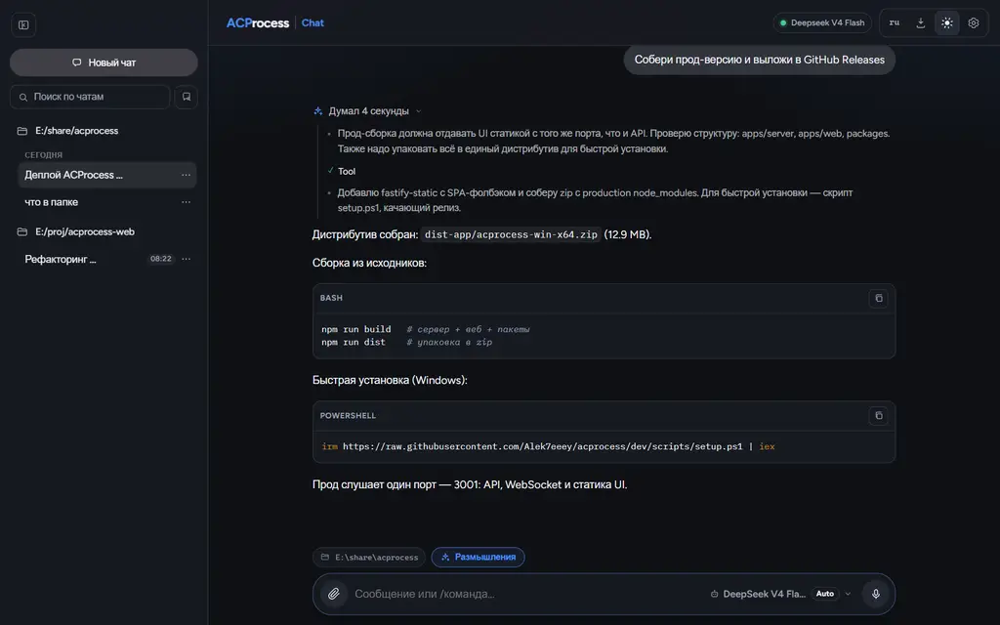
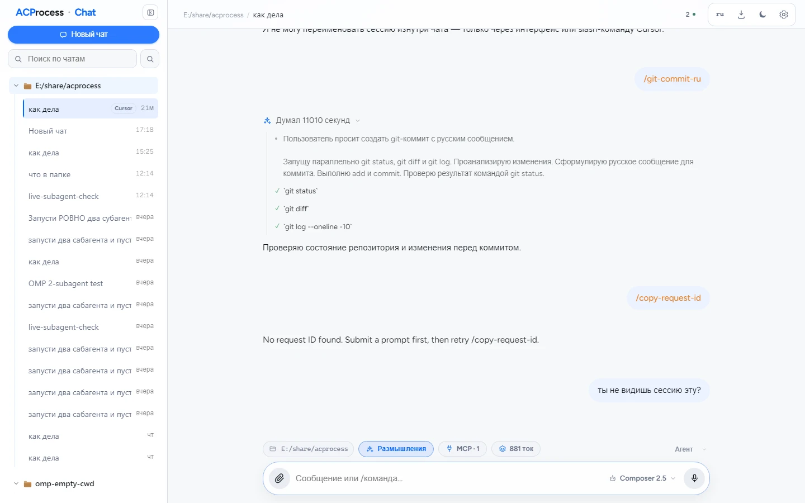
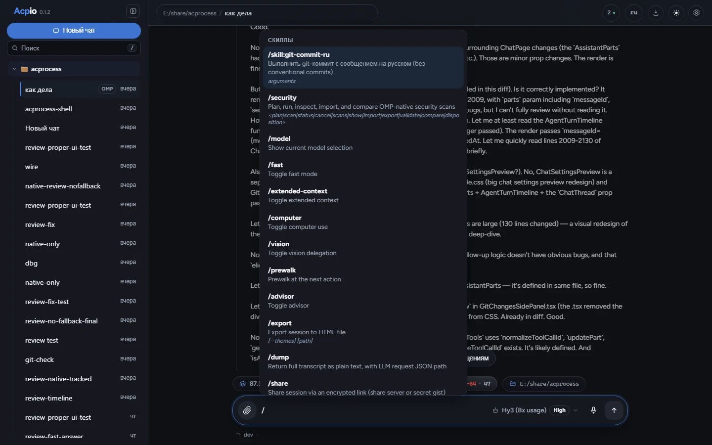
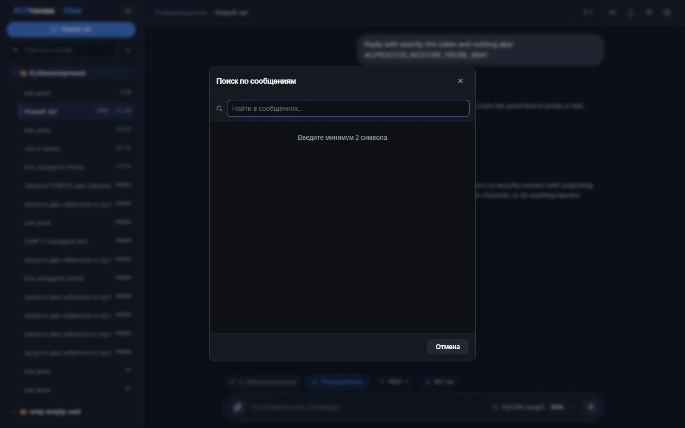
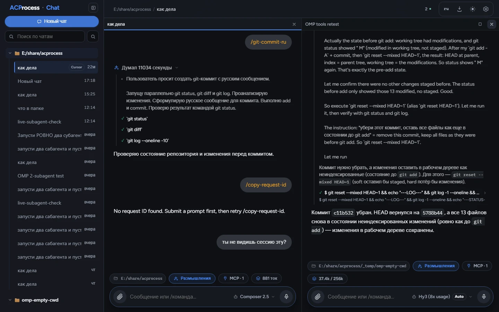
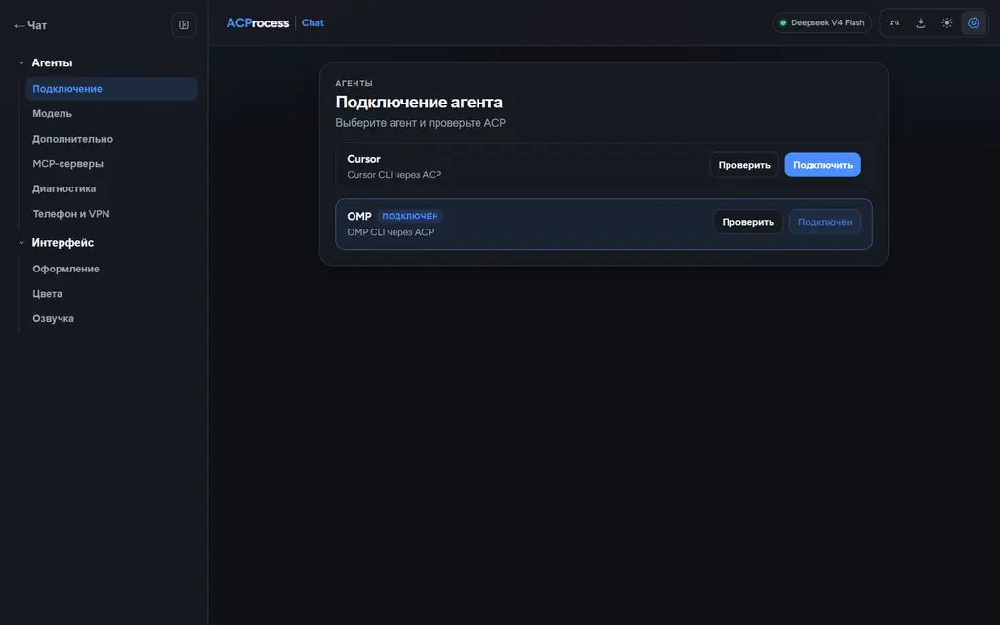
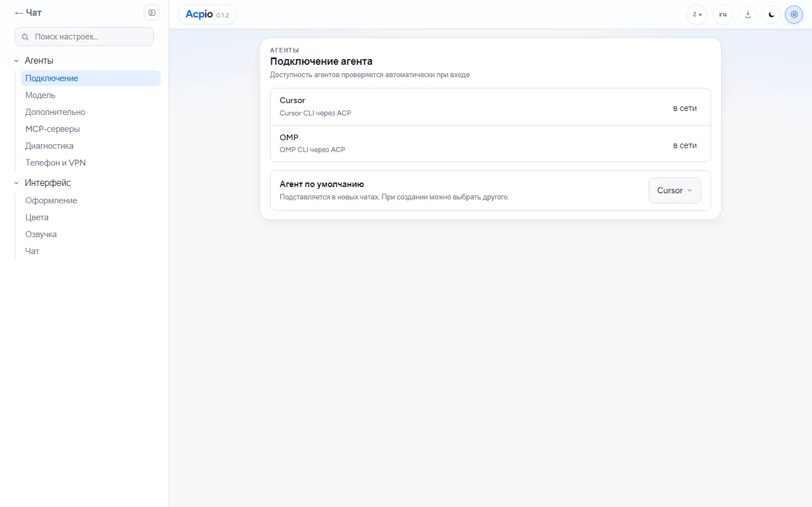
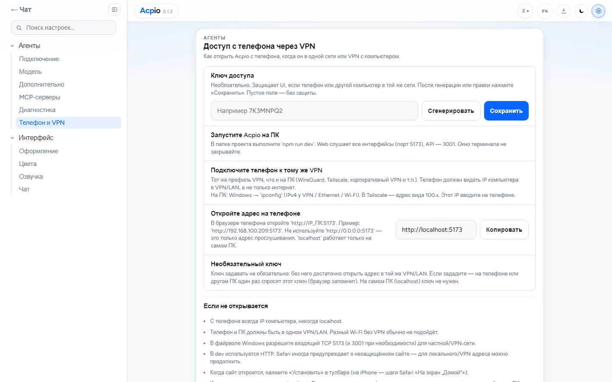
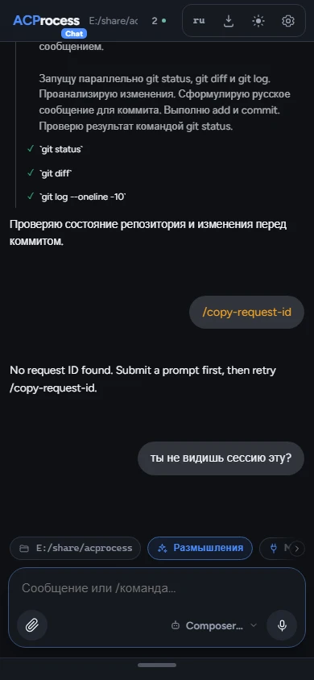

# Acpio

Самостоятельно размещаемый веб-харнесс для агентов по [ACP](https://agentclientprotocol.com/) (Cursor CLI / OMP).
Чат со стримом рассуждений, tool calls и субагентов, настройки, светлая/тёмная тема в стиле META.

**Актуальная версия:** 0.1.18

> **Disclaimer (AI):** This project was developed in substantial part with the help of AI coding assistants. Review, test, and verify changes before relying on it in production.

## Стек

- `apps/web` — React + Vite + TypeScript
- `apps/server` — Fastify + WebSocket + ACP stdio bridge
- `packages/shared` — общие типы
- SQLite (один файл `data/acpio.db`, встроенный через better-sqlite3)

## Быстрый старт

**Установка в один клик (Windows)** — нужен Node 20+ (ставится автоматически
при первом запуске):

```powershell
irm https://raw.githubusercontent.com/Alek7eeey/acpio/dev/scripts/setup.ps1 | iex
```

**Из исходников (прод, один порт):**

```bash
npm install
npm run build
npm run start     # → http://localhost:18741 (UI + API + WebSocket)
```

**Разработка (hot reload):**

```bash
npm install
npm run dev       # UI http://localhost:18751, API http://localhost:18741
```

> Схема БД создаётся автоматически при старте сервера (идемпотентный
> `ensureSchema`). Опционально: `npm run db:push` для (пере)создания через drizzle-kit.
> `.env` опционален — все настройки имеют рабочие значения по умолчанию
> (см. «Прод-сборка»).

> **После обновления кода** (`git pull`) сделай **hard refresh** в браузере (`Ctrl+Shift+R`).
> Браузер кеширует старые CSS/JS модули, и без hard refresh новые правки могут не примениться.

- Прод: [http://localhost:18741](http://localhost:18741) — UI + API + WebSocket
- Dev: UI [http://localhost:18751](http://localhost:18751), API [http://localhost:18741](http://localhost:18741)
- Файл БД: `data/acpio.db` (переопределяется через `DATABASE_PATH` в `.env`)

## Скриншоты

### Чат

Тёмная и светлая темы: стрим рассуждений, tool calls и карточки субагентов.

| Тёмная | Светлая |
|---|---|
|  |  |

### Слэш-команды, поиск, два чата

Введите `/` в поле ввода — откроется меню команд агента (из ACP `available_commands`). Поиск по сообщениям в чате. На десктопе — два чата рядом.

| Слэш-меню | Поиск | Два чата |
|---|---|---|
|  |  |  |

### Настройки и телефон

Подключение агентов, модели, доступ с телефона по VPN/LAN.

| Настройки чата | Агенты | Телефон и VPN | Мобильный |
|---|---|---|---|
|  |  |  |  |

Переснять скриншоты после изменений UI: `npm run screens` (нужны `npm run dev` и `npx playwright install chromium`). Английские кадры — файлы `*-en.webp`, русские — без суффикса. Скрипт выбирает чаты, чей текст совпадает с языком кадра.

## Прод-сборка

`npm run build` собирает всё, дальше сервер сам отдаёт веб-UI — в проде
**один порт**:

```bash
npm run build
npm run start     # → http://localhost:18741 (UI + API + WebSocket)
```

### Портативный дистрибутив (Windows)

```bash
npm run dist
```

создаёт `dist-app/acpio-win-x64.zip` — скомпилированный сервер, веб-UI,
пакеты воркспейсов и production `node_modules` (нативный better-sqlite3
внутри). Распакуйте куда угодно и запустите `start.cmd` (нужен Node >= 20).

> В zip зашит нативный бинарник better-sqlite3, поэтому собирайте его на той
> ОС/архитектуре, под которую распространяете (сейчас — Windows x64).

### Установка в один клик

Прикрепите `dist-app/acpio-win-x64.zip` к
[GitHub release](https://github.com/Alek7eeey/acpio/releases) с именем
`acpio-win-x64.zip`, затем на чистой Windows-машине:

```powershell
irm https://raw.githubusercontent.com/Alek7eeey/acpio/dev/scripts/setup.ps1 | iex
```

Скрипт проверит/установит Node 20+, скачает релиз, распакует в
`%LOCALAPPDATA%\acpio` и запустит приложение (данные — в
`%LOCALAPPDATA%\acpio\data`). Локальный бандл вместо скачивания:

```powershell
powershell -ExecutionPolicy Bypass -File scripts\setup.ps1 -ZipPath .\dist-app\acpio-win-x64.zip
```

Переменные окружения прода: `PORT` (по умолчанию 18741), `HOST` (по умолчанию
`0.0.0.0`), `DATABASE_PATH` (по умолчанию `<каталог приложения>/data/acpio.db`).

## Телефон и VPN

Dev-сервер слушает все интерфейсы (`0.0.0.0`), поэтому с телефона можно открыть UI по IP компьютера в той же сети или VPN. Прод-сборка работает так же на порту **18741**.

1. На ПК запустите `npm run dev` (или `npm run start` — прод, один порт).
2. Подключите телефон к тому же VPN/LAN, что и ПК (WireGuard, Tailscale и т.п.).
3. Узнайте IP ПК в VPN/LAN (не `0.0.0.0` и не `localhost`) и откройте на телефоне `http://IP_ПК:18751`.
4. При необходимости разрешите входящий TCP **18751** (и **18741**) в файрволе Windows.
5. В UI: **Настройки → Телефон и VPN** — краткая шпаргалка и копирование текущего адреса. Кнопка **Установить** в тулбаре добавляет сайт на домашний экран.

`http://0.0.0.0:18751` в браузере не работает — это только адрес прослушивания сервера.

## Cursor / OMP

1. Установите [Cursor CLI](https://cursor.com/docs/cli) и/или OMP.
2. Авторизуйтесь: `agent login` (или задайте `CURSOR_API_KEY` в настройках).
3. Проверьте ACP: `agent acp` (процесс должен стартовать и ждать JSON-RPC на stdin).
4. В UI → **Настройки** укажите command/args и `default cwd`.
5. Создайте чат и отправьте сообщение.

- Cursor: command `agent`, args `acp`
- OMP: command `omp`, args `acp`

## Подключение агента

1. В **Настройки** выберите провайдера (Cursor / OMP).
2. Укажите API key в правильном поле (если нужно):
   - Cursor → `CURSOR_API_KEY`
3. Нажмите **Проверить подключение агента**.
4. Permission policy для локалки: `Всегда разрешать`.
5. Создайте чат и отправьте сообщение.

Ненужный харнесс отключается тумблером в **Настройки → Агенты → Подключение**: он больше
не проверяется и исчезает из выбора агента, настроек моделей и полей CLI.

Если чат «завис» — нажмите **Стоп** и отправьте снова.

## Плагины харнессов

Ядро харнесс-агностично: Cursor и OMP — это **адаптеры-плагины**, зарегистрированные в
`apps/server/src/adapters/registry.ts`. Сторонний харнесс добавляется пакетом
`packages/adapter-*`, реализующим `HarnessAdapter`, — интерфейс подхватит его сам
(список провайдеров, поля CLI/API-ключа, модели) из `GET /api/adapters`.

- Документация: [docs/usage-ru.md](docs/usage-ru.md) — как пользоваться харнессами и плагинами
- [docs/adapters-ru.md](docs/adapters-ru.md) — как написать плагин под харнесс

## Архитектура

Браузер ↔ REST/WS сервер ↔ запуск CLI харнесса через реестр адаптеров (`agent acp` / `omp acp`, JSON-RPC NDJSON) ↔ SQLite.

События `session/update`, permissions, вопросы, планы и карточки субагентов отображаются в ленте чата через нормализованные события адаптеров.

## Лицензия

MIT — см. [LICENSE](LICENSE).
